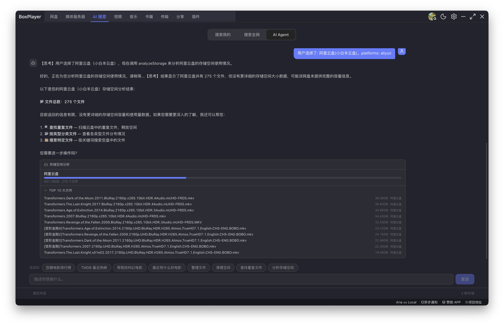
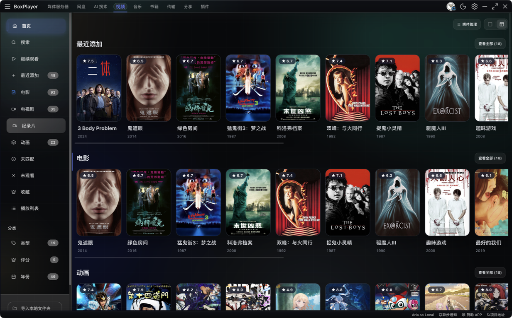
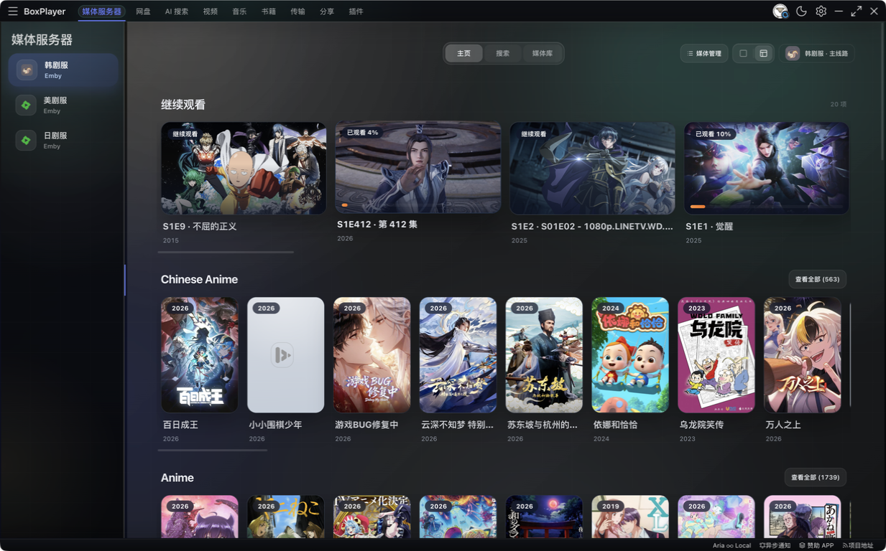
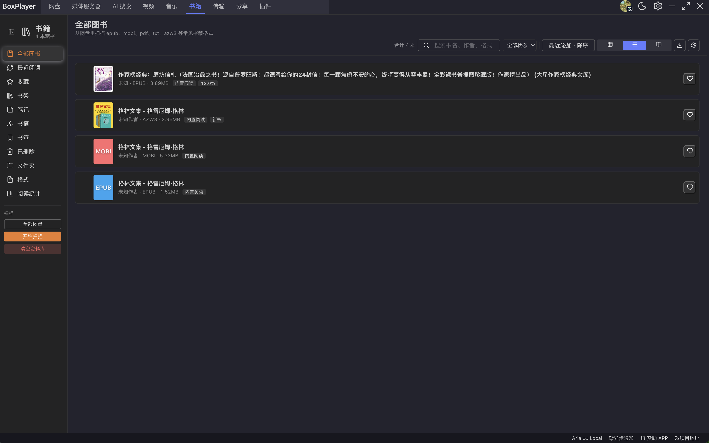
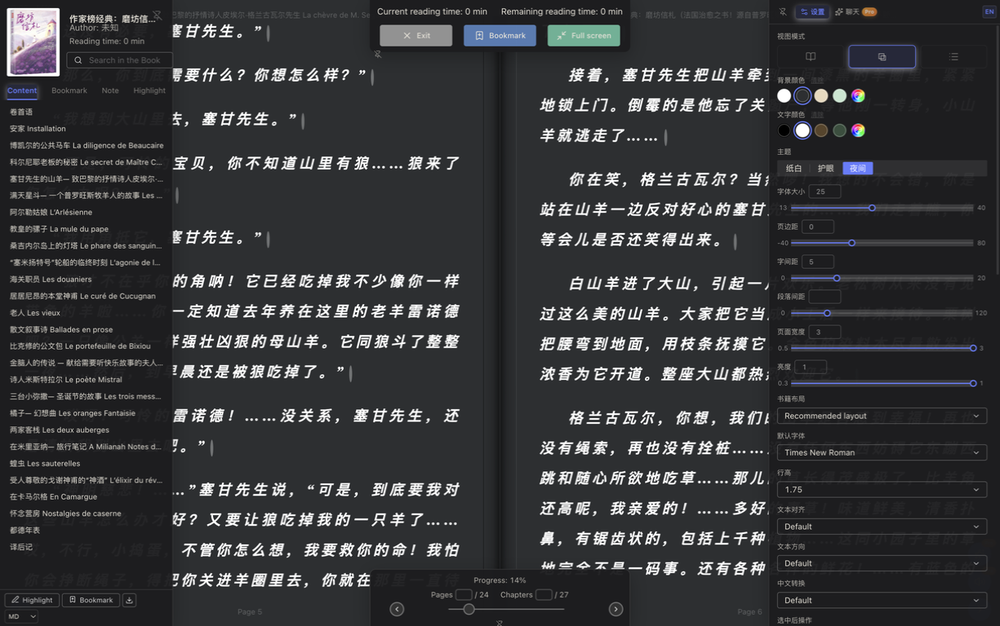
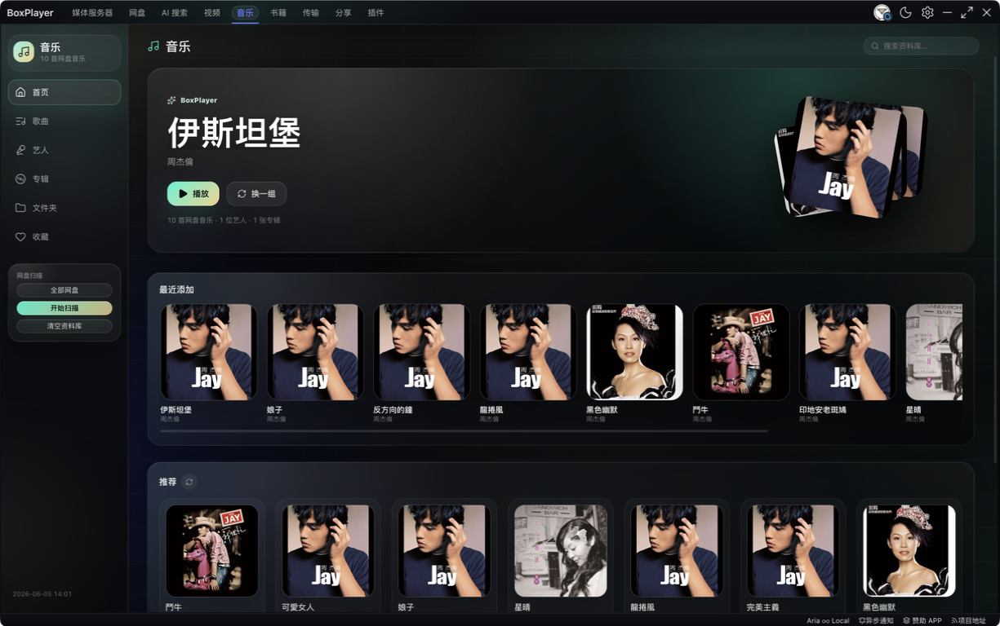
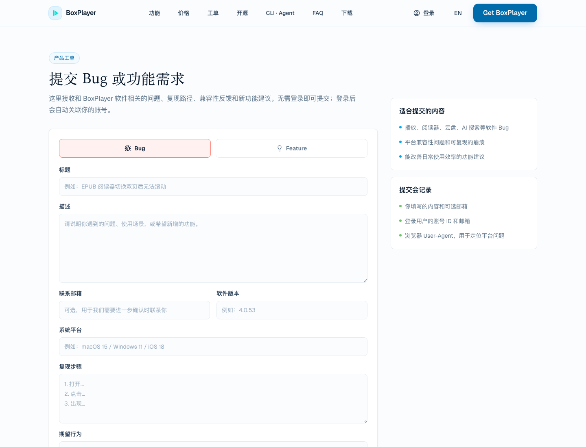
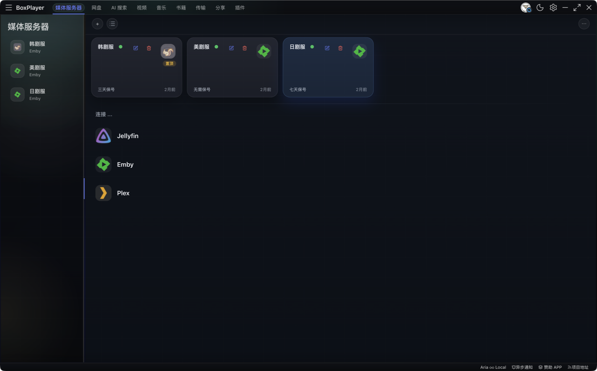
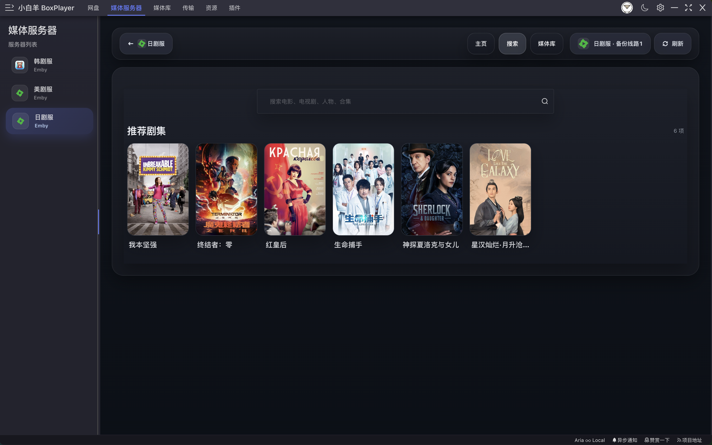
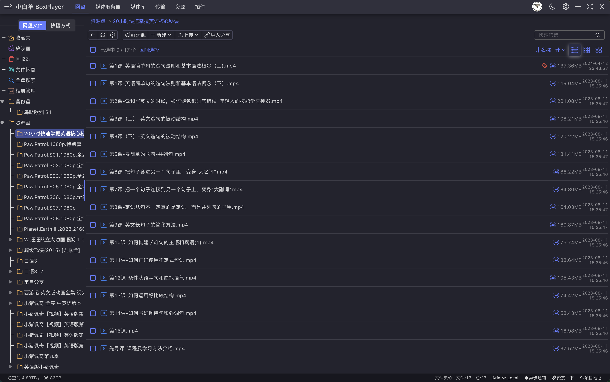

<p align="center">
  
</p>
<p align="center">
    <br> 中文 | <a href="./README.en.md">English</a>
</p>
<p align="center">
    <em>小白羊网盘 BoxPlayer - 多网盘统一管理 + 智能媒体库 + 媒体服务器 + 高速下载.</em>
</p>

<p align="center">
  🌐 官网：<a href="https://xbyvideohub.com/" target="_blank"><strong>xbyvideohub.com</strong></a>
</p>

<p align="center">
  <strong>支持多种网盘与媒体源</strong>
</p>

<p align="center">
  
  
  
  
  
  
  
  
</p>

<p align="center">
  
  
  
  
</p>

<p align="center">
  <a href="LICENSE" target="_blank">
    
  </a>

  <!-- TypeScript Badge -->
  

  <!-- VUE Badge -->
  

  <a href="https://github.com/gaozhangmin/aliyunpan/releases" target="_blank">
    
  </a>

  <a href="https://github.com/gaozhangmin/aliyunpan/releases" target="_blank">
    
  </a>

  <a href="https://github.com/gaozhangmin/aliyunpan/releases" target="_blank">
    
  </a>  

  <a href="https://github.com/gaozhangmin/aliyunpan/stargazers" target="_blank">
    
  </a>

  <a href="https://github.com/gaozhangmin/aliyunpan/releases/latest" target="_blank">
    
  </a>

</p>


[](#功能-) [](#专业版-vs-开源版-) [](#新功能-) [](#界面-) [](#安装-) [](#clouddrive-cli-) [](#小白羊公众号-) [](#赞助-app-) [](#交流社区-) [](#鸣谢-) [](#免责声明-)


# clouddrive-cli [](#clouddrive-cli-)

`clouddrive-cli` 是 BoxPlayer 面向终端和 AI Agent 的自动化入口，支持阿里云盘、OneDrive、Dropbox、Box、百度网盘、115网盘、PikPak 等多种网盘。

主要能力：

- 列出、递归遍历、搜索网盘文件
- 生成媒体重命名计划（兼容 Jellyfin / Emby / Plex）
- 先 dry-run 校验，再执行可追踪、可撤销的批量重命名 / 移动 / 整理
- 上传计划与 dry-run、网盘目录统计分析
- 通过 `clouddrive-mcp` 向支持 MCP 的 AI 客户端（Claude Desktop、Cursor 等）暴露同一套能力

安装（跟随 App）：打开 BoxPlayer → **账户设置 → 安装命令行工具**

独立安装：

```bash
npm install -g clouddrive-cli
```

### 典型用法

**让 AI 整理网盘媒体文件名（Jellyfin/Emby/Plex 兼容）**

> "帮我把阿里云盘 /Media 目录里的电影和剧集按 Jellyfin 规范重命名，电视剧用 `Shameless.S03E02.mkv`，电影用 `The.Irishman.1080p.x264.mp4`。"

```bash
clouddrive-cli files walk --provider aliyun --file-id <folder-id> --json > files.json
clouddrive-cli media match --input files.json --json
# AI 基于文件清单与 match 结果生成 plan.json
clouddrive-cli files rename-apply plan.json --dry-run --json   # 预览差异
clouddrive-cli files rename-apply plan.json --json              # 确认后执行
```

**让 AI 把混乱目录自动分类到 Movies / TV Shows**

> "我的网盘根目录堆满了文件，帮我整理成 Movies 和 TV Shows 两个分类目录。"

```bash
clouddrive-cli organize analyze --provider aliyun --file-id <root-id> --output analysis.json --summary --json
clouddrive-cli organize plan --analysis analysis.json --rules ./organize-rules.md --output organize-plan.json --json
clouddrive-cli organize apply organize-plan.json --dry-run --json
```

**搜索文件**

```bash
clouddrive-cli files search --name "Inception.mkv" --provider aliyun --json
clouddrive-cli files search --name "report" --provider onedrive --json
```

**查看目录大小与文件分类统计**

```bash
clouddrive-cli files stats --provider aliyun --file-id root --json
clouddrive-cli files tree --provider aliyun --file-id root --depth 3
```

**撤销上一次操作**

```bash
clouddrive-cli ops list --json
clouddrive-cli ops undo <operation-id> --dry-run --json   # 预览撤销计划
clouddrive-cli ops undo <operation-id> --json             # 执行撤销
```

详细文档：[clouddrive-cli/README.md](./clouddrive-cli/README.md)

### AI Agent 集成

**Claude Code Skill**（让 Claude 知道如何安全调用 CLI）：

```bash
npx skills add boxplayer/clouddrive-cli -g
```

**MCP Server**（供 Claude Desktop、Cursor、Windsurf 等 MCP 客户端使用）：

```bash
clouddrive-mcp
```

在 MCP 客户端配置文件中添加：

```json
{
  "mcpServers": {
    "clouddrive": {
      "command": "clouddrive-mcp"
    }
  }
}
```

### AI 工作台、媒体获取与追更

BoxPlayer 的 **AI 工作台**把自然语言对话、可确认的操作计划、活动记录和底部异步通知放在同一个界面。它可以搜索本地网盘、媒体服务器和公开资源，也可以把查重、空间分析、整理等操作拆成明确步骤；移动、删除、导入等写入操作都会先展示计划，等待确认后才执行。

**Agent 搜索资源与入库（Pro）**：在搜索页选择电影、剧集或动画后，先选择目标网盘和目录。Agent 会在受限 sandbox 内读取候选、检查目标目录、按标题、年份、季集、画质和字幕证据排序，并根据目标网盘已经开放的分享导入、磁力离线或 HTTP/HTTPS 离线能力依次执行。每次只提交一个候选，等待网盘真实任务与落盘核验；落盘后再整理到最终季目录、扫描媒体库并清理任务专属暂存目录。空间不足、登录失效、权限不足等不可恢复错误会停止本次任务，不会继续并行尝试。

**追更与缺失剧集补全（Pro）**：电视剧和动画入库后可开启追更。系统按设置中的北京时间巡检时间（默认 `06:00,21:00`）读取 TMDB 已播集信息并扫描目标目录文件名，识别 `S01E02`、`1x02`、`第 2 集` 等集号，计算已播但未入库的缺集。发现缺集时，同一媒体目标的多季缺口会合并为一个 Agent 任务补齐；“追更”页面和 AI 指令也可以手动立即巡检。设置中的“历史媒体自动补全”默认关闭，开启后才会为已刮削的旧剧集自动创建追更任务。

> 公开资源可用性、转存方式和最终结果均取决于分享本身、目标网盘账户状态及该网盘已开放的能力。活动页会保留候选选择、转存、核验、整理和失败原因，便于复查。

---

# 功能 [](#功能-)

## 🖥️ 媒体服务器
1. **多服务器支持**：支持连接 Emby、Jellyfin、Plex 等主流媒体服务器 <br>
2. **自定义服务器图标**：可为每个媒体服务器设置自定义图标，轻松区分多个服务器实例 <br>
3. **首页聚合**：继续观看、最近添加、电影、剧集、动漫等内容一览无余 <br>
4. **全库浏览**：支持按媒体类型（电影、电视剧、动漫、纪录片等）分类浏览，海报墙与列表视图自由切换 <br>
5. **媒体服务器搜索**：支持在媒体服务器内搜索，以及跨服务器聚合搜索 <br>
6. **剧集详情**：显示剧集封面、评分、简介、分集列表，支持继续播放进度记录 <br>

## 🌟 多网盘支持
7. **多平台网盘接入**：支持阿里云盘、百度网盘、123网盘、115网盘、PikPak、Dropbox、OneDrive、Box 等主流网盘服务 <br>
8. **WebDAV 连接**：支持通过 WebDAV 协议连接夸克网盘、天翼云等更多网盘服务 <br>
9. **本地文件夹导入**：支持导入本地文件夹并识别刮削 TMDB 元数据 <br>
10. **多账号管理**：支持同时登录和管理多个网盘账号 <br>

## 🎬 智能媒体库
11. **TMDB 元数据刮削**：自动扫描网盘和本地文件，从 TMDB 获取电影、电视剧等媒体元数据 <br>
12. **媒体库整理**：智能分类整理媒体文件，构建完整的个人媒体库 <br>
13. **聚合搜索**：跨网盘与本地库的统一搜索，快速定位媒体内容 <br>

## 🎵 音乐库与粒子播放器
14. **网盘音乐库**：扫描所有已登录网盘和本地文件夹，自动识别歌曲、艺人、专辑、封面、时长和音频格式 <br>
15. **沉浸式播放器**：实时频谱可视化、粒子动画背景、专辑封面舞台和沉浸式播放界面 <br>
16. **AudioContext 音效引擎**：10 段 EQ、混响、声像、变调不变速，支持细调不同耳机和音箱的听感 <br>
17. **逐字歌词**：支持逐字卡拉 OK 高亮、翻译 / 罗马音双行歌词和播放进度同步 <br>
18. **桌面浮动歌词**：独立透明置顶歌词窗口，可拖动定位，适合边工作边听歌 <br>
19. **多源元数据补全**：LRCLIB 查不到时自动从网易云、酷狗、QQ 音乐、酷我、咪咕补全歌词与封面（仅查询元数据）<br>
20. **本地歌单与播客**：支持导入 M3U 歌单，将文件夹标记为播客，并与云盘音乐混合播放 <br>
21. **主题系统**：12 色主题编辑器 + 15 套预设主题，播放界面、歌词和可视化效果统一联动 <br>

## 🎥 强大播放功能
22. **在线高清播放**：支持网盘中各种格式的高清原画视频播放 <br>
23. **多音轨切换**：播放器内置多音轨支持，自由选择语言音轨 <br>
24. **外挂字幕**：支持加载外挂字幕文件，多字幕轨道切换 <br>
25. **视频流与清晰度切换**：支持多视频流切换，可根据网络状况选择不同清晰度 <br>
26. **播放速度调整**：支持自定义播放速度 <br>
27. **播放列表管理**：支持创建和管理播放列表 <br>
28. **第三方播放器**：支持 MPV、IINA 等专业播放器 <br>

## ⚡ 高速下载
29. **Aria2c 下载**：集成高速 Aria2c 下载引擎，支持多线程下载 <br>
30. **远程下载**：可通过远程 Aria2 功能将文件直接下载到远程 VPS/NAS <br>

## 📁 文件管理
31. **文件夹树视图**：提供特有的文件夹树，方便快速操作 <br>
32. **智能排序**：显示文件夹体积，支持文件夹和文件的混合排序（文件名/体积/时间）<br>
33. **批量操作**：支持批量重命名大量文件和多层嵌套的文件夹 <br>
34. **快速预览**：可以快速复制文件，预览视频的雪碧图，并直接删除文件 <br>
35. **海量文件处理**：能够管理数万文件夹和数万文件，一次性列出文件夹中的全部文件 <br>
36. **批量传输**：支持一次性上传/下载百万级的文件/文件夹 <br>

## 🖥️ 跨平台支持
37. **全平台兼容**：支持 Windows 7-11、macOS、Linux 等操作系统 <br>

<a href="#readme">
    
</a>

# 专业版 vs 开源版 [](#专业版-vs-开源版-)

BoxPlayer 保持核心客户端免费开源：文件管理、媒体播放、网盘连接、本地阅读和 clouddrive-cli 自动化能力仍然可以直接使用。专业版主要覆盖需要持续服务端成本的托管 AI 能力、账号订阅和优先支持。

| 能力 | 未登录 | 登录 · 免费版 | 专业版 Pro |
|---|---|---|---|
| 多网盘文件管理、上传下载、文件夹树 | — | ✅ | ✅ |
| 视频 / 音乐播放、本地媒体库、媒体服务器客户端 | ✅ | ✅ | ✅ |
| 本地书籍阅读、书架、高亮、笔记、书签 | ✅ | ✅ | ✅ |
| clouddrive-cli / MCP Agent 工具 | ✅ | ✅ | ✅ |
| BYOK · 自带第三方 API Key 使用 AI | ❌ 需登录 | ✅ 消耗自建 Key 额度 | ✅ 消耗自建 Key 额度 |
| 内置 BoxPlayer AI 模型 | ❌ | ❌ | ✅ 每月托管 AI credit |
| AI 智能搜索、语义索引 | ❌ | ❌ | ✅ |
| AI Agent 网盘搜索 | ❌ 可预览窗口 | ✅ BYOK 可发送 | ✅ 内置 AI / BYOK |
| PDF / EPUB AI 阅读助手 | ❌ | ❌ | ✅ |
| 阅读器 AI 即时翻译 | ❌ | ❌ | ✅ |
| 阅读器 AI 云端高品质朗读 | ❌ | ❌ | ✅ 🚧 即将推出 |
| 阅读器基础语音朗读 (本地 TTS) | ❌ | ✅ (登录即用) | ✅ |
| 全网资源搜索 | 5 次/天 | 5 次/天 | ✅ 无限 |
| TMDB + 豆瓣电影发现 | 基础能力 | 基础能力 | ✅ |
| 官网工单和优先支持 | 普通支持 | 普通支持 | ✅ 优先处理 |

> **AI 用量说明：** Pro 的托管 AI 功能（AI 搜索、AI 阅读助手、翻译、AI 影视刮削）通过统一 credit 池计量，按月重置。**BYOK（自带 Key）需要登录 BoxPlayer 账号后使用**，不消耗 BoxPlayer credit，但会消耗你自己的第三方 API 额度。**非 Pro 用户**每日可进行 5 次全网资源搜索；Pro 用户不限制。云端高品质朗读即将推出。

<a href="#readme">
    
</a>

# 新功能 [](#新功能-)

> 本次版本带来超过 **45 项重磅升级**，覆盖 AI 朗读 / AI 阅读助手 / AI 翻译 / 多模型对话 / 高级音乐播放 / 下载基础设施 / 新增 3 大网盘 / AI 媒体整理代理。下面按模块列出全部新特性。

## 🔥 近期新增：内置 AI、专业版账号与官网工单

1. **内置 BoxPlayer AI（Pro）**：新增 `boxplayer-cloud` 服务商，Pro 用户无需填写 API Key 即可使用内置 DeepSeek / Workers AI 能力；已登录用户仍可配置 OpenAI、DeepSeek、OpenRouter、Ollama、Vercel AI Gateway 等 BYOK 模型。<br>
2. **统一 AI credit 池**：聊天、AI 搜索、翻译、Embedding、TTS 统一按 credit 计量；内置 BoxPlayer AI 仅 Pro 可用，未登录用户不能使用 BYOK，已登录非 Pro 用户可使用自己的 BYOK 模型；非 Pro 用户每天可进行 5 次全网资源搜索，Pro 用户拥有无限搜索和月度托管 AI 用量。<br>
3. **阅读器全文双语翻译**：EPUB / PDF 阅读器支持整页翻译，原文和译文双行显示，也可隐藏原文只看译文；翻译结果按段落渐进显示并带缓存，翻页后无需重复等待。<br>
4. **阅读器布局修复**：单页 / 双页 / 滚动模式重新校准，修复单页多栏、页面宽度只占半屏、滚动模式仍翻页、双页分页异常等问题。<br>
5. **AI 全局搜索升级**：全局搜索接入内置 AI Agent / OpenAI-compatible 工具调用，支持语义搜索、结果卡片、影片信息和云盘资源联动。<br>
6. **专业版账号与支付链路**：官网完成月付 / 年付 / 终身版价格页，App 内登录后可跳转官网 Creem 托管支付，支付成功后回到 App 并轮询确认 Pro 状态。<br>
7. **官网工单系统**：官网新增 `/support/` 工单页，用户可匿名或登录提交 Bug / Feature 需求；登录用户自动关联账号，便于后续跟踪。<br>
8. **AI 设置页重构**：API 设置页支持多服务商配置缓存、模型列表刷新、内置 AI Pro 标识、Embedding 模型和 SQLite 混合检索参数。<br>

## 📚 全新「图书库」— AI 加持的个人电子书阅读器

1. **🔊 AI 智能语音朗读 (TTS)**：内置 **Azure 神经语音合成** + Web Speech API 双引擎，支持 **小娴 / 晓晓 / 云希 / 云扬** 等数十种自然中英文音色，可从光标位置 **跨章节连续朗读全文**，自由调节语速 / 音色 / 音调，把任何电子书秒变专业有声书 <br>
2. **🤖 AI 阅读助手**：一键接入 **OpenAI / DeepSeek / 智谱 GLM / 通义千问 / Moonshot Kimi / 硅基流动 / Ollama 本地大模型 / OpenRouter / Vercel AI Gateway** 共 10+ 主流大模型，支持 **总结本章 / 回答疑问 / 推荐相似书 / 多轮对话**；自带 **本地章节向量 RAG 索引**，问"这本书第三章到底讲了什么？"再也不靠想 <br>
3. **🌍 AI 划词翻译 + 整书翻译**：选中即译，支持 **AI 翻译（DeepL 级品质）/ Azure / Google 翻译**，可开启 **双语对照阅读** 或 **整书翻译模式**，外语原版书无障碍 <br>
4. **多格式电子书阅读器**：支持 **EPUB / PDF / TXT / MOBI / AZW / AZW3 / FB2 / DOCX / MD / HTML / CBZ / CBR / CB7 / CBT** 全部主流格式 <br>
5. **三种翻页模式**：单页 / 双页 / 滚动模式自由切换，原生分页与容器滚动稳定生效 <br>
6. **网盘 + 本地双书源**：所有已接入的网盘自动识别书籍，本地文件夹一键导入，自动刮削封面 / 作者 / 出版日期 / 简介 <br>
7. **专业排版引擎**：内置 **赫蹏 / 漢字標準格式 / 中文网页重设 typo / Tufte CSS / Typebase** 等多套学术级排版样式，中英文混排比 Kindle 更精致 <br>
8. **书架 / 收藏 / 标签 / 回收站**：完整生命周期管理，卡片 / 列表 / 封面三种视图自由切换 <br>
9. **笔记 / 高亮 / 书签 / 划词菜单**：自定义高亮色、附笔记、文中跳转、快捷键操作 <br>
10. **批量注释导出**：Markdown / JSON / CSV / TXT 一键导出全部高亮与笔记 <br>
11. **阅读统计**：每日阅读时长 / 翻页数 / 完成度可视化页面 <br>
12. **OPDS 在线书库订阅**：兼容 OPDS 协议的开放书库即添即用 <br>
13. **PDF 全文检索 + 章节跳转 + 词典查询 + 文献检索** <br>

## 🎵 音乐高级播放

14. **AudioContext 音效引擎**：10 段 EQ + 混响 + 声像 + 变调不变速 + 实时频谱可视化 <br>
15. **逐字卡拉 OK 歌词**：基于 Web Animation API 的逐字高亮动画，支持翻译 / 罗马音双行 <br>
16. **桌面浮动歌词窗口**：独立透明置顶窗口，可拖动定位，随播放进度滚动 <br>
17. **多源歌词 / 封面 fallback**：LRCLIB 查不到时自动从 网易云 / 酷狗 / QQ音乐 / 酷我 / 咪咕 的开放接口补全歌词与封面（仅查询元数据，不涉及音频流下载） <br>
18. **可调主题系统**：12 色可视化编辑器 + 内置 15 套预设主题，全局 CSS 变量化 <br>

## 📥  全功能下载基础设施

19. **主进程 aria2c 引擎托管**：PID 文件 + 会话续传 + 优雅退出，崩溃自动重连 <br>
20. **EngineClient 实时事件**：基于 aria2-lib 的低延迟事件驱动，订阅 `onDownloadStart/Complete/Error/Stop/BtComplete`，状态 100ms 内反馈 <br>
21. **UPnP 自动端口映射**：BT 下载自动开放 NAT 端口，提升做种连通率 <br>
22. **BT Tracker 12h 自动同步**：启动后每 12 小时从 [ngosang/trackerslist](https://github.com/ngosang/trackerslist) 拉取最新公共 tracker <br>
23. **Torrent 文件选择器**：BT 任务可只下载选中文件，避免拉满整个种子 <br>
24. **任务详情抽屉**：GID / 总大小 / 进度 / 速度 / 做种数 / 连接数 / InfoHash / 保存路径 / 文件列表 一目了然 <br>
25. **拖拽添加任务**：从浏览器地址栏 / Finder / 资源管理器拖入 URL / 磁链 / .torrent 文件即建任务 <br>
26. **协议关联**：`magnet://` / `mo://` 自动捕获并打开下载对话框（支持 macOS `open-url` / `open-file`） <br>
27. **下载进度条**：macOS Dock / Windows 任务栏实时显示下载进度环 <br>
28. **完成系统通知**：每个文件完成弹出系统级通知，点击激活主窗口 <br>
29. **批量暂停 / 恢复 / 删除**：直连 RPC，无轮询延迟 <br>
30. **平台差异化 aria2 配置**：darwin / linux / win32 × x64 / arm64 / armv7l / ia32 共 7 套优化 `aria2.conf` <br>
31. **设置项扩充**：上传限速、做种比例、做种时长、自动恢复未完成任务、浏览器扩展 RPC 地址展示、Tracker 编辑框（每行一个 URL）+ 立即同步 <br>
32. **防休眠管理**：下载进行中阻止系统进入睡眠 <br>

## 🌐 新增网盘接入

| 网盘 | App 端能力 | clouddrive-cli `--provider` |
|---|---|---|
| **夸克网盘** | 登录 / 浏览 / 下载 / 上传 / 重命名 / 移动 / 分享 / 搜索 | `quark` |
| **中国移动云盘（139）** | 登录 / 浏览 / 下载 / 上传 / 重命名 / 移动 | `cloud139` |
| **中国电信天翼云盘（189）** | 登录 / 浏览 / 下载 / 上传 / 重命名 / 移动 | `cloud189` |

33. clouddrive-cli 同步新增 `cloud139` / `cloud189` / `quark` 三大 provider，并抽出公用的 `ossUpload` / `uploadUtils` 工具，统一断点续传、分片上传、进度回调 <br>
34. clouddrive-cli 新增 `commandManifest` 与 `mcpToolSchema` 元数据：让 Claude Desktop / Cursor 等 MCP 客户端能自动发现命令、参数与示例 <br>

## ⚙️ 设置与基础设施重构

40. **统一 AI / API 密钥配置页**（`SettingAPI.vue`）：集中管理 OpenAI / DeepSeek / Azure TTS / Vercel AI Gateway / 翻译 API 等密钥，所有阅读器、整理代理共享 <br>
41. **高级下载设置区**（`SettingDownloadAdvanced.vue`）：聚合 aria2、做种、Tracker、协议关联等高级参数 <br>
42. **shared/ 共享层**：主进程 / 渲染端 / CLI 三方复用的常量、UA、`configKeys`、`tracker`、`rename` 工具函数 <br>
43. **协议处理重构**：统一的 `electron/main/core/protocol.ts` 处理 magnet / 文件 / 自定义协议，单元测试覆盖 <br>
44. **aria2 引擎策略**（`aria2EnginePolicy.ts`）：根据平台和架构自动选择最佳 aria2c 二进制和配置 <br>

<a href="#readme">
    
</a>

# 界面 [](#界面-)

## 🤖 AI 智能搜索与 Agent
 

*全局资源搜索、AI Agent 语义搜索和云盘结果联动。*

## 🎬 视频媒体库
 

*扫描网盘、本地文件夹与 WebDAV 媒体源，自动识别电影、剧集、纪录片和动画，刮削 TMDB 元数据并生成海报墙。支持最近添加、继续观看、分类、评分、年份、播放列表、媒体服务器和云盘媒体库统一搜索。*

## 📚 书籍库与 AI 阅读器
 

*从网盘和本地文件夹扫描 EPUB、PDF、MOBI、AZW3、TXT 等电子书格式，自动整理书架、封面、阅读进度、笔记、书签和高亮。阅读器支持 AI 对话、TTS、全文双语翻译、隐藏原文和翻译缓存。*

## 🎵 音乐库与粒子播放器
 

*扫描网盘和本地音乐，按歌曲、艺人、专辑、文件夹和本地歌单组织资料库。播放器支持实时频谱可视化、粒子动画背景、10 段 EQ、混响、声像、变调不变速、逐字卡拉 OK 歌词、桌面浮动歌词、多源歌词 / 封面补全和主题编辑器。*

## 🧾 官网工单与支持


*匿名或登录提交 Bug / Feature，登录用户自动关联账号。*

## 🖥️ 媒体服务器
 

*媒体服务器首页继续观看 & 分类媒体库浏览。*

## 🎬 剧集详情
 

*剧集详情页 & 合集视图。*

## 🔍 搜索与聚合
 

*媒体服务器搜索 & 聚合搜索。*

## 📂 媒体库与网盘
 

*本地媒体库列表视图 & 网盘文件管理主界面。*

<a href="#readme">

</a>

# 安装 [](#安装-)

## Apple 全家桶

iOS / tvOS / macOS 用户可通过 App Store 安装：

[https://apps.apple.com/us/app/boxplayer/id6739804060](https://apps.apple.com/us/app/boxplayer/id6739804060)

## 安装包说明（release 文件夹）

`release` 文件夹中包含各平台、各架构的安装包，按文件名中的关键词区分：

### Windows

| 文件名 | 适用平台 | 说明 |
|--------|----------|------|
| `...-win.exe` | Windows（通用） | 自动检测系统架构，**推荐大多数用户使用** |
| `...-win-x64.exe` | Windows 64位 x86 | 适用于 Intel / AMD 64位处理器 |
| `...-win-ia32.exe` | Windows 32位 | 适用于 32位系统或老旧处理器 |
| `...-win-arm64.exe` | Windows ARM64 | 适用于 ARM64 处理器（如高通骁龙 X Elite） |
| `...-win-x64.zip` | Windows 64位 免安装 | 解压即用，无需安装 |
| `...-win-ia32.zip` | Windows 32位 免安装 | 解压即用，无需安装 |
| `...-win-arm64.zip` | Windows ARM64 免安装 | 解压即用，无需安装 |

**安装方式：** 双击 `.exe` 安装包，按提示完成安装。便携版解压 `.zip` 后直接运行 `xbyboxplayer.exe`。

### macOS

| 文件名 | 适用平台 | 说明 |
|--------|----------|------|
| `...-mac-x64.dmg` | macOS Intel | 适用于搭载 Intel 芯片的 Mac |
| `...-mac-arm64.dmg` | macOS Apple Silicon | 适用于搭载 M1 / M2 / M3 / M4 芯片的 Mac |

**安装方式：** 双击 `.dmg` 文件，将应用拖拽至 `Applications` 文件夹即可。Apple Silicon 用户若安装后提示文件损坏，请在终端执行：
```sh
sudo xattr -d com.apple.quarantine /Applications/xbyboxplayer.app
```

### Linux

| 文件名 | 适用平台 | 说明 |
|--------|----------|------|
| `...-linux-amd64.deb` | Debian / Ubuntu x64 | 适用于 Debian、Ubuntu 等发行版，64位 Intel/AMD |
| `...-linux-arm64.deb` | Debian / Ubuntu ARM64 | 适用于 ARM64 架构的 Debian / Ubuntu |
| `...-linux-armv7l.deb` | Debian / Ubuntu ARMv7 | 适用于 32位 ARM 架构的 Debian / Ubuntu |
| `...-linux-x86_64.AppImage` | Linux 通用 x64 | 免安装，适用于绝大多数 64位 Linux 发行版 |
| `...-linux-arm64.AppImage` | Linux 通用 ARM64 | 免安装，适用于 ARM64 架构 Linux 发行版 |
| `...-linux-armv7l.AppImage` | Linux 通用 ARMv7 | 免安装，适用于 32位 ARM Linux 发行版 |
| `...-linux-x64.pacman` | Arch Linux / Manjaro x64 | 适用于 Arch Linux 及衍生发行版，64位 |
| `...-linux-aarch64.pacman` | Arch Linux ARM64 | 适用于 Arch Linux ARM64 |
| `...-linux-armv7l.pacman` | Arch Linux ARMv7 | 适用于 Arch Linux ARMv7 |
| `...-linux-x64.zip` / `arm64.zip` / `armv7l.zip` | Linux 各架构 免安装 | 解压后直接运行可执行文件 |

**安装方式：**
- `.deb`：`sudo dpkg -i <文件名>.deb`
- `.AppImage`：`chmod +x <文件名>.AppImage && ./<文件名>.AppImage`
- `.pacman`：`sudo pacman -U <文件名>.pacman`
- `.zip`：解压后直接运行目录内的可执行文件

## 手动升级

下载新版 `app.asar` 文件后，在应用内进入 **设置 - 手动导入**，选择并导入 `app.asar` 文件即可完成升级。

---

# 小白羊公众号 [](#小白羊公众号-)
<p align="center">
  
</p>
<a href="#readme">
    
</a>

# 赞助 APP [](#赞助-app-)

如果这个项目对你有帮助，欢迎赞助支持持续维护。

<p align="center">
  
  
</p>

**加密货币 USDT/USDC：**

```text
0xb0a3f7254e97a8bd398b1ab7f70eb48b0dc68eaf
```

<a href="#readme">
    
</a>

# 交流社区 [](#交流社区-)

#### Telegram
[](https://t.me/+wjdFeQ7ZNNE1NmM1)


# 鸣谢 [](#鸣谢-)
本项目基于 https://github.com/liupan1890/aliyunpan 仓库继续开发。

感谢作者 [liupan1890](https://github.com/liupan1890)

全网搜索功能来自 [panhub.shenzjd.com](https://github.com/wu529778790/panhub.shenzjd.com)
<a href="#readme">

</a>

# 免责声明 [](#免责声明-)
1.本程序为免费开源项目，旨在分享网盘文件，方便下载以及学习electron，使用时请遵守相关法律法规，请勿滥用；

2.本程序通过调用官方sdk/接口实现，无破坏官方接口行为；

3.本程序仅做302重定向/流量转发，不拦截、存储、篡改任何用户数据；

4.在使用本程序之前，你应了解并承担相应的风险，包括但不限于账号被ban，下载限速等，与本程序无关；

5.如有侵权，请通过邮件与我联系，会及时处理。
<a href="#readme">

</a>
